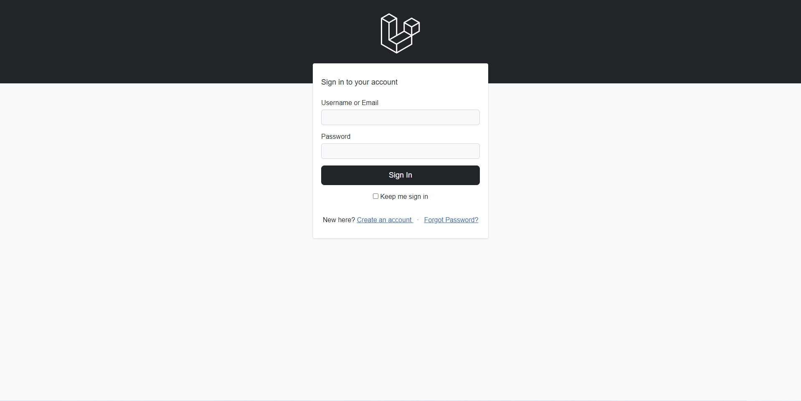

# Mages
A Mages (Bootstrap 5, Alpine.js, Laravel and Livewire) Preset for Laravel

## Installation

This preset is intended to be installed into a fresh Laravel application. Follow [Laravel's installation instructions](https://laravel.com/docs/installation) to ensure you have a working environment before continuing.





### Installation (without auth)

Then simply run the following commands:
```bash
composer require livewire/livewire olakunlevpn/mages
php artisan ui mages
npm install
npm run dev
```

### Installation (with auth)

If you would like to install the preset and its auth scaffolding in a fresh Laravel application, make sure to use the `--auth` flag on the `ui` command:

```bash
composer require livewire/livewire olakunlevpn/mages
php artisan ui mages --auth
npm install
npm run dev
```

Some notable features of the authentication scaffolding include:
- Powered by Livewire components and single action controllers
- Bundled with pre-written tests

All routes, components, controllers and tests are published to your application. The idea behind this is that you have full control over every aspect of the scaffolding in your own app, removing the need to dig around in the vendor folder to figure out how things are working.
